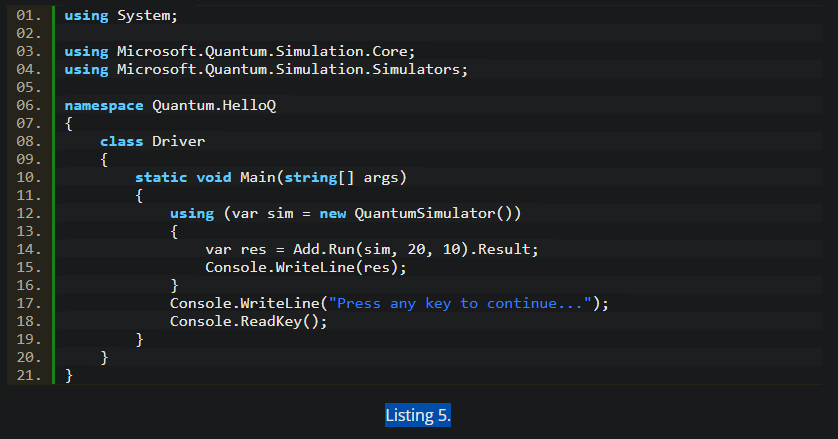

*In this tutorial, you’ll learn how to build your first simple “Hello World” Q# app. Just follow these following steps.*

## Step 1. Install Visual Studio 2017

To build quantum computing applications, you will need the latest version of Visual Studio 2017 (15.6 or later).

Download Visual Studio 2017 Community edition from [here](https://www.visualstudio.com/downloads/ "here"): 

## Step 2. Install Microsoft Quantum Development Kit

Visit Microsoft’s Quantum Computing home page [here](https://www.microsoft.com/en-us/quantum/development-kit "here"):

Click on "Download Now" button.

On the next page, fill out the details and click on "Download Now".

This action will send you to the Visual Studio Marketplace and [download](https://marketplace.visualstudio.com/items?itemName=quantum.DevKit "download") the Quantum Development Kit page:

Download Quantum Development Kit and installed it. Once the installation is completed, you should see the following Figure 2.

nstallation of the Quantum Development Kit adds Q# Visual Studio project templates to the VS templates list.

## Step 3. Create Q# Project

Now, let’s create our first Q# application.

Open Visual Studio 2017 Community and go to File > New Project > Visual C#. We see three Q# project templates – Q# Application, Q# Library, and Q# Test Project.

Select Q# Application project template, type your project name and click OK. See Figure 3.

The default solution looks like Figure 4.

Each Q# application has two default files – the C# driver (Driver.cs) and quantum code (Operation.qs). C# driver code listed in Driver.cs file is the entry point of the application. This code will look familiar to C# developers. See Listing 1.

The quantum code is in Operation.qs

## Step 4. Write a Q# Operation

Let’s write some Q# code that will do something. For the simplicity sake, I’ll create a simple operation in Q# that adds two integers and returns the total of the two.

Open Operation.qs and replace the code with Listing 3.

In Listing 3, first of all, we import the Microsoft.Quantum.Primitive namespace.

open Microsoft.Quantum.Primitive;

Next, we write an operation. The basic unit of quantum execution is an operation. It is equivalent to a C/C++ function or a static method in C# or Java. The code snippet in Listing 4 is an operation.

An operation starts with the keyword “operation”. An operation can be with or without arguments and can return nothing or a value. The arguments are a form of a tuple. If you’re not familiar with tuples, check out Tuples in C#. The type of an argument is defined using a colon. The return value is also separated from the arguments using a colon.

The operation Add declared in Listing 4 takes two arguments of int type and returns the sum of the two values. Each operation has a body section that contains the implementation of the operation.

## Step 5. Execute a Q# Operation

The Main method of the Driver class is the gateway to the program that executes Q# code. Since there is no real quantum computer on my laptop, the way to execute a Q# program is using a quantum simulator. The quantum simulator is installed as a part of the QDK.

The QuantumSimulator class defined in the Microsoft.Quantum.Simulation.Simulators

namespace represents a simulator. The following code snippet creates a quantum simulator.

using (var sim = new QuantumSimulator())

An operation is executed by using a call operation.Run(simulator, arguments). The following code snippet executes the Add operation.

var res = Add.Run(sim, 20, 10).Result;

The complete code of Driver class is listed in Listing 4. The code calls the Add operation by passing a simulator, two arguments of integer type, and the results are returned in a var.

## Step 6. Build and Run

If you build the project, you will get a bunch of errors. To fix that, you need to target a specific framework and platform.

Right click on project name in Solution Explorer and click on Properties. On Application settings, change Target framework to 4.6.1 and on Build settings, change Platform target from Any CPU to x64. See Figure 5.

Now Build and Run the application and you should see result 30 printed on the console i.e. total of the two values passed to the Q# operation.

# Summary

**Q#** is the newest programming language introduced by Microsoft to write a quantum computing based application. In this article, you learned how to install Quantum Development Kit, setup up Visual Studio 2017 for a Q# project, write our first Q# code, and build and execute it.

